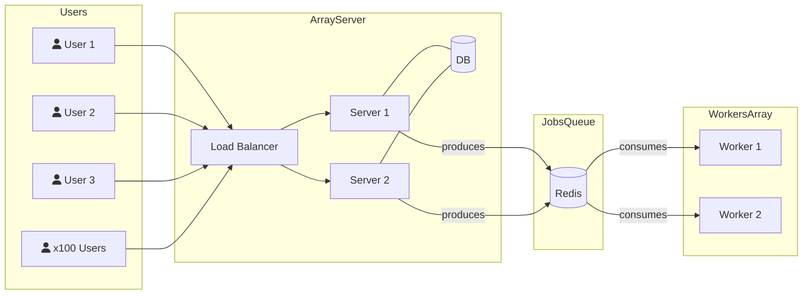

# Job Queue Service using Redis Queue and BullMQ

This project is a job queue service built using Redis Queue and BullMQ. It is designed to handle multiple users connecting to the server, with a load balancer distributing the load among multiple servers. The servers produce jobs that are stored in a Redis queue, which are then consumed by worker processes.

## System Architecture

The following diagram illustrates the system architecture:



## Getting Started

The current project is built using Docker and Docker Compose. To get started, clone the repository and run the following command:

```bash
docker-compose up
```

This command runs the following services:

- **redis**: Redis server
- **server-one**: Server 1
- **server-two**: Server 2
- **worker-one**: Worker 1
- **dashboard**: BullMQ dashboard
- **load-balancer**: NGINX Load balancer


Note that all these containers are using some ports on your machine. If you have any of these ports already in use, you can change them in the `docker-compose.yml` file. Ports used by each service are:

- **redis**: 6379
- **server-one**: 3000
- **server-two**: 3001
- **dashboard**: 8082
- **load-balancer**: 80

## Usage

Once you have the project up and running with `docker-compose up`, you can interact with it as follows:

- **Accessing server via load balancer**: The load balancer is accessible at `http://localhost`. You can send HTTP requests to this URL to interact with the servers.
    Useful endpoints are:
    - **GET /**: Returns a simple hello world message.
    - **GET /template**: Add a job to the queue and returns a html template.
    - **GET /admin**: Returns the dashboard of the BullMQ queue.

- **Accessing the servers directly**: The servers are accessible at `http://localhost:3000` and `http://localhost:3001`. You can send HTTP requests to these URLs to interact with the servers. `GET /` and `GET /template` are the same as above.

- **Accessing the dashboard**: The BullMQ dashboard is accessible at `http://localhost:8082/admin`. Here, you can monitor the status of the job queue.

Please note that these are the default port configurations. If you have changed any ports in the `docker-compose.yml` file, you will need to use the updated port numbers to access the services.

## Contributing

Contributions are welcome! Please read our contributing guidelines before getting started.

## License
This project is licensed under the MIT License.