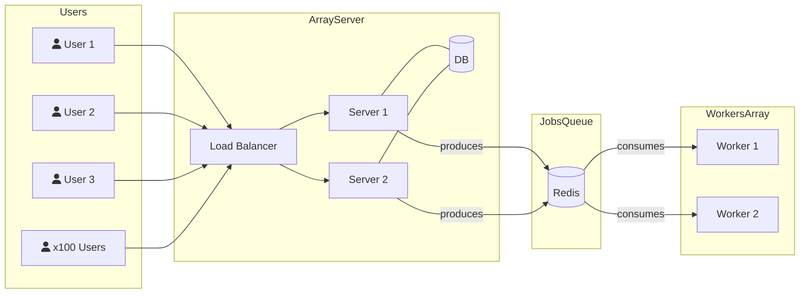

# Job Queue Service using Redis Queue and Kuejs

<!-- create a mermaid graph having a load balancer then two servers -->
<!-- Those server are job producers. Behind then it should exists a job server (Kuejs) using a Redis DB -->
<!-- There should be two Job Consumers that connect to the Job server -->

<!-- add several users connecting to the upfront server -->

